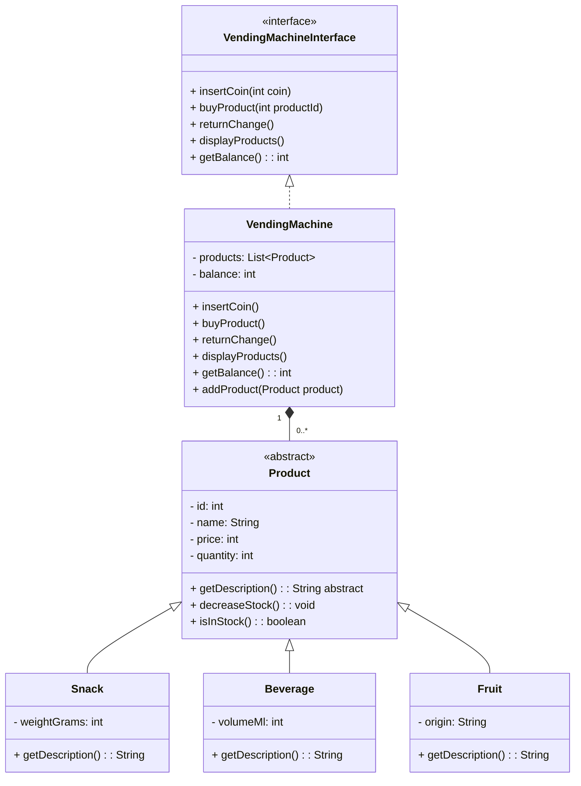

# Lexicon Vending Machine

A Java console-based vending machine application.

## Features

- Supports snacks, beverages, and fruits
- Accepts Swedish coins:
  - 1 kr
  - 2 kr
  - 5 kr
  - 10 kr
  - 20 kr
  - 50 kr
- Handles:
  - product selection
  - balance management
  - automatic change return
  - stock management
  - invalid purchases

## Diagram



## Build

Clone the repository and run:

```bash
mvn clean package
```

After building run java -jar target/VendingMachine-1.0.SNAPSHOTjar
